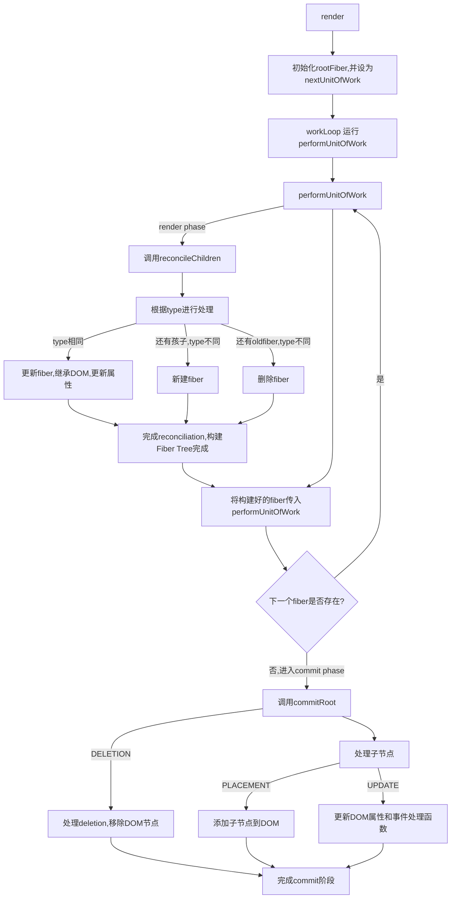

# micro-react

build your own react with vanilla js

# Step Zero: Review & Step I: The createElement Function

## replace createElement

createElement 允许您创建一个 React 元素。它可以作为编写 JSX 的替代方案。

```js
// jsx usage
const element = <h1 title='foo'>Hello</h1>;
const container = document.getElementById('root');
ReactDOM.render(element, container);
```

To create an element without JSX, call createElement with some type, props, and children:

`createElement(type, props, ...children) `
`createElement('h1', {}, child1, child2, child3)`

```js
// createElement usage
import { createElement } from 'react';

function Greeting({ name }) {
  return createElement(
    'h1',
    { className: 'greeting' },
    'Hello ',
    createElement('i', null, name),
    '. Welcome!'
  );
}
```

```jsx
function Greeting({ name }) {
  return (
    <h1 className='greeting'>
      Hello <i>{name}</i>. Welcome!
    </h1>
  );
}
```


## replace ReactDOM.render

**node 相关 api 请查询 DOM 资料**

```js
const element = {
  type: 'h1',
  props: {
    title: 'foo',
    children: 'Hello',
  },
};

const container = document.getElementById('root');

const node = document.createElement(element.type);
node['title'] = element.props.title;

// Using textNode instead of setting innerText will allow us to treat all elements in the same way later. Note also how we set the nodeValue like we did it with the h1 title, it’s almost as if the string had props: {nodeValue: "hello"}.

// 不通过innerHtml去创建文本节点，而是通过createTextNode去创建，如果是是纯文本则通过createTextNode去创建，如果是其他的元素则通过createElement去创建。
const text = document.createTextNode('');
text['nodeValue'] = element.props.children;

node.appendChild(text);
container.appendChild(node);
```

# Step II: The `render` Function

```js
export default function render(element, container) {
  // 创建dom
  const dom =
    element.type === 'TEXT_ELEMENT'
      ? document.createTextNode('')
      : document.createElement(element.type);

  // 添加属性
  Object.keys(element.props)
    .filter((key) => key !== 'children')
    .map((key) => (dom[key] = element.props[key]));

  // 把children的节点内容追加进父节点dom中,递归渲染子元素
  element.props.children.map((child) => render(child, dom));

  // 把dom追加到父节点root中
  container.append(dom);
}
```

# Step III: Concurrent Mode

> **并发模式**（Concurrent Mode）是 React 的一项实验性功能，它允许 React 在执行更新时更好地利用浏览器的空闲时间。 在并发模式下，React 可以将长时间运行的渲染任务拆分为多个较小的任务，这些任务可以在浏览器的空闲时间内执行，从而避免阻塞主线程。 并发模式的目标是提高应用程序的响应性。

> As of November 2019, Concurrent Mode isn’t stable in React yet.

当我们的第一版 render 函数在运行的时候，函数只会在递归渲染完所有的节点后才会停止，这会中断主线程的任务进行。如果浏览器需要执行优先级更高的任务比如用户的输入或者顺滑的动画效果，那么我们也需要等到 render 函数运行完毕才可以。

react 把所有的渲染工作切碎成一个一个小的工作单元，当浏览器有更高优先级任务，会允许浏览器终端下一个要进行的工作单元。

每一个 filber 就是一个 unit of work，浏览器进程可以打断每一个 fiber，优先级高的事情处理完之后，告诉 react，react 在进行下一步的 fiber 处理。

我们通过 `requestIdleCallback` 进行 `eventloop`

> The **`window.requestIdleCallback()`** method queues a function to be called during a browser's idle periods.
>
> `requestIdleCallback`是一个浏览器提供的 API，用于在浏览器空闲时执行任务，以避免阻塞主线程并提高页面性能。它接受一个回调函数作为参数，该函数在浏览器空闲时执行。

`requestIdleCallback(callback)`

requestIdleCallback schedules the low-priority or non-essential function to be called in the free time at the end of the frame.

The callback function is passed an [`IdleDeadline`](https://developer.mozilla.org/en-US/docs/Web/API/IdleDeadline) object describing the amount of time available and whether or not the callback has been run because the timeout period expired.

`requestIdleCallback` also gives us a deadline parameter. We can use it to check how much time we have until the browser needs to take control again.

```js
function lowPriorityWork(deadline) {
  while (deadline.timeRemaining() > 0 && workList.length > 0)
    performUnitOfWork();

  if (workList.length > 0) requestIdleCallback(lowPriorityWork);
}
```

```js
let remainingWork = totalWork;

function idleCallback(deadline) {
  while (deadline.timeRemaining() > 0 && remainingWork > 0) {
    // 执行任务的一部分工作
    remainingWork--;

    if (remainingWork <= 0) {
      // 任务已完成，退出循环
      break;
    }
  }

  if (remainingWork > 0) {
    requestIdleCallback(idleCallback);
  }
}

// 设置总工作量
const totalWork = 100;

// 请求执行任务
requestIdleCallback(idleCallback);
```

# Step IV: Fibers

## Fiber and fiber

> This new reconciliation algorithm from React is called Fiber Reconciler. The name comes from fiber, which it uses to represent the node of the DOM tree.

**reconciliation algorithm**

比对/协调算法，react 里的 reconciliation 是比对 ui 组件更新前后的数据，它的作用是 React 用来区分一个节点树和另一个节点树的算法，以确定哪些部分需要更改。

the action of making consistent or congruous （in dictionary

> fiber: 是一个简单的 js 对象，表示的是 React element 或者是 a node of the DOM tree，是一个工作单元(unit of work)
>
> Fiber: is the React Fiber reconciler.React Fiber creates a linked list of nodes where each node is a fiber.

fiber object actually look: You can find the detailed structure in the[ React codebase](https://github.com/facebook/react/blob/main/packages/react-reconciler/src/ReactInternalTypes.js#L49).

## Fiber Tree

Fiber Tree Structure: a fiber only has one child and one sibling.如果有多个子节点的话，那么就成为 child.sibling.sibling...

Fiber Tree 也是为了更快的找到下一个工作单元

```jsx
function App() {
  // App
  return (
    <div className='wrapper'>
      {' '}
      // W<div className='list'>
        {' '}
        // L<div className='list_item'>List item A</div> // LA
        <div className='list_item'>List item B</div> // LB
      </div>
      <div className='section'>
        {' '}
        // S<button>Add</button> // SB
        <span>No. of items: 2</span> // SS
      </div>
    </div>
  );
}

ReactDOM.render(<App />, document.getElementById('root')); // HostRoot
```


Refs: https://www.youtube.com/watch?v=0ympFIwQFJw

## Reconciliation

`reconciliation` 的含义和作用，通过[Top-Down Reconciliation](https://legacy.reactjs.org/blog/2015/12/18/react-components-elements-and-instances.html#top-down-reconciliation) 和 [Reconciliation](https://legacy.reactjs.org/docs/reconciliation.html)官文可以了解到：reconciliation is the algorithm for diffing two DOM trees.这是 React 称之为协调的一部分流程，它始于调用 ReactDOM.render()或 setState()方法。在协调的结束时，React 会知道最终的 DOM 树结构，然后像 react-dom 或 react-native 这样的渲染器会应用最小化的变化来更新 DOM 节点

**The main goals of the Fiber reconciler are**

1. incremental rendering, better or smoother rendering of UI animations and gestures, and responsiveness of the user interactions.
2. allows you to divide the work into multiple chunks and divide the rendering work over multiple frames. It also
3. adds the ability to define the priority for each unit of work and pause, reuse, and abort the work.

**How does React Fiber work?**

Fiber brings in different levels of priority for updates in React. It breaks the computation of the component tree into nodes, or 'units' of work that it can commit at any time. This allows React to pause, resume or restart computation for various components.

Fiber allows the reconciliation and rendering to the DOM to be split into two separate phases:

Phase 1: Reconciliation phase / Render Phase

异步的

In the first phase, React creates a list of all changes to be rendered in the UI (an 'effect list', comprising of new and updated components).
Once the list is fully computed, React will schedule these changes to be executed in the next phase.
Note that React doesn't make any actual changes in this phase.

Phase 2: Commit phase

同步的

In phase two, also called 'commit' phase, React tells the DOM to render the effect list that was created in the previous phase.

While the Reconciliation phase can be interrupted, the Commit phase cannot.

So via Fiber, React is able to traverse the component tree through a singly linked list tree traversal algorithm. This algorithm can run in an "asynchronous" manner - allowing React to pause and resume work at particular nodes.

```js
function performUnitOfWork(fiber) {
  // TODO add dom node
  // TODO create new fibers
  // TODO return next unit of work
}
```

```js
if (index === 0) {
  fiber.child = newFiber;
} else {
  prevSibling.sibling = newFiber;
}

prevSibling = newFiber;
```

这段记录一下，如果`index === 0`，则` fiber.child = newFiber;`，跳出判断，走`prevSibling = newFiber;`，下一次循环 fiber tree 进入判断的时候，` prevSibling.sibling = newFiber;`中的`prevSibling.sibling`是上一次构建好的`newfiber`，即`child.sibling = newFiber`

# Step V: Render and Commit Phases

**the browser could interrupt our work before we finish rendering the whole tree.**

根据之前阶段里提到的，React Fiber work 有两个阶段，一个是 render，一个是 commit，这块就把之前混合在一起提交到 dom 的处理，分成这两个阶段。

# Step VI: Reconciliation

## reconcileChildren func

为什么写这个函数：we need to compare the elements we receive on the render function to the last fiber tree we committed to the DOM.

for update and delete DOM.

可以只更新做了修改的节点，而不是每次做所有的节点的更新

To compare them we use the type

1. if the old fiber and the new element have the same type, we can keep the DOM node and just update it with the new props

2. if the type is different and there is a new element, it means we need to create a new DOM node

3. and if the types are different and there is an old fiber, we need to remove the old node




# Step VII: Function Components

# Step VIII: Hooks

hook 是做什么的 把两次渲染的数据关联起来，

初始化全局变量方便在 useState 中使用

We need to initialize some global variables before calling the function component so we can use them inside of the useState function.

用数组去储存多个 hook

add a hooks array to the fiber to support calling useState several times in the same component. And we keep track of the current hook index.

setState function that receives an action (for the Counter example this action is the function that increments the state by one).

`setState((prev) => prev + 1)`

`(prev) => prev + 1` -> function that setState function received.

# refs

1. [react createElement](https://react.dev/reference/react/createElement)
2. [build-your-own-react with vanilla js tutorial](https://pomb.us/build-your-own-react/)
3. [An Introduction to React Fiber - The Algorithm Behind React](https://www.velotio.com/engineering-blog/react-fiber-algorithm)
4. [window: requestIdleCallback() method](https://developer.mozilla.org/en-US/docs/Web/API/Window/requestIdleCallback)
5. [React 的思考（五）- Reconciliation](http://benweizhu.github.io/blog/2018/04/22/deep-thinking-in-react-5/)
6. [【翻译】Reconciliation React 比对算法](https://github.com/cnsnake11/blog/blob/master/ReactNative%E7%BF%BB%E8%AF%91/Reconciliation.md)
7. [React Components, Elements, and Instances](https://legacy.reactjs.org/blog/2015/12/18/react-components-elements-and-instances.html#top-down-reconciliation)
8. [Introduction to React Fiber](https://flexiple.com/react/react-fiber/)
9. [React Virtual DOM, Reconciliation and Fiber Reconciler](https://namansaxena-official.medium.com/react-virtual-dom-reconciliation-and-fiber-reconciler-cd33ceb0478e)
